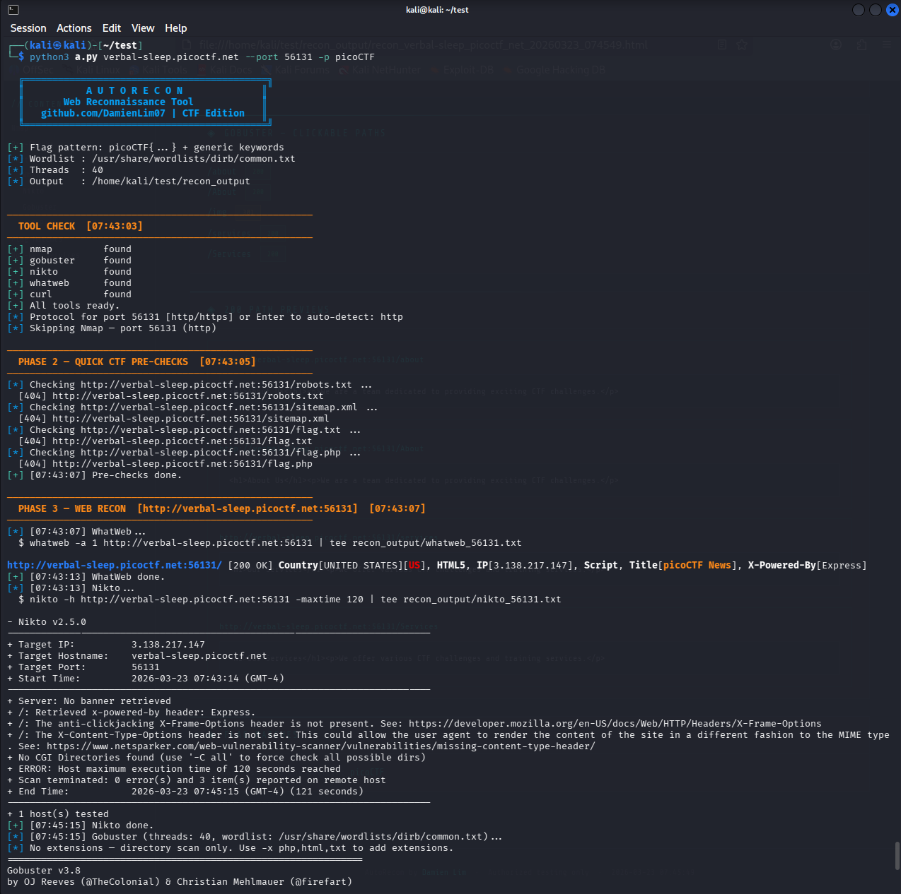
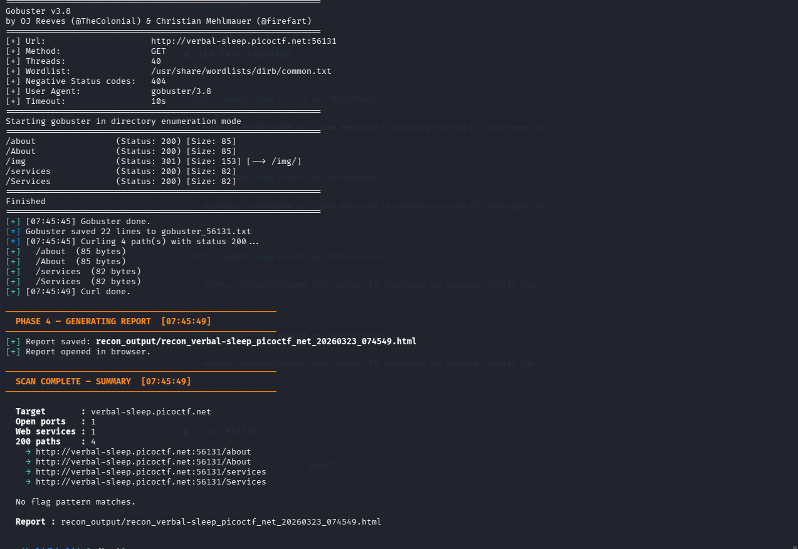
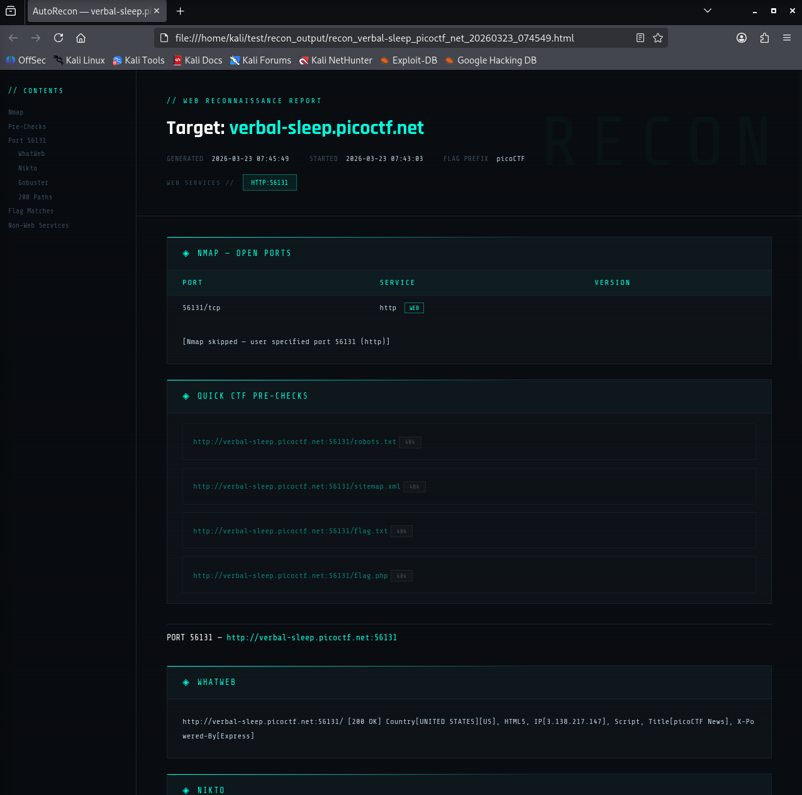
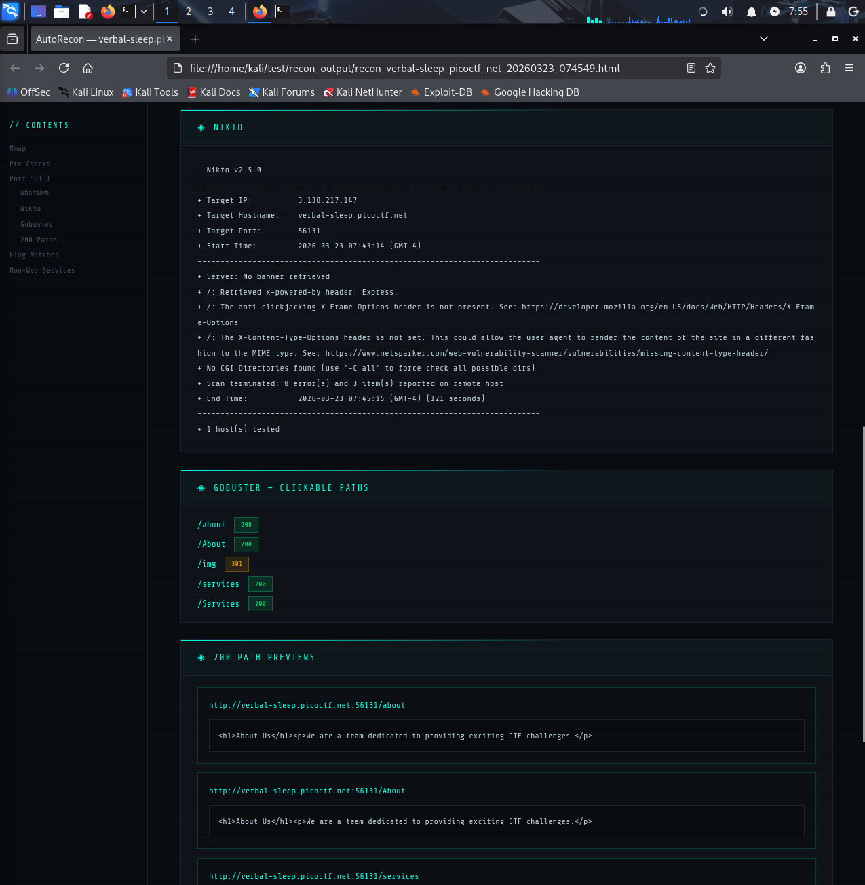
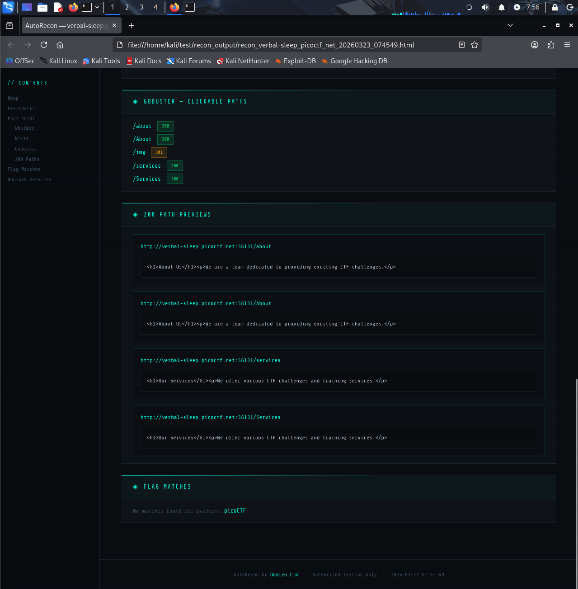

# AutoRecon 

**CTF-focused web reconnaissance tool**. Adaptive, fast, and purpose-built for finding flags.

> **Download:** [`recon.py`](recon.py) or copy the script and save it as whatever you like.

---

## Overview

AutoRecon orchestrates web recon tools at **native speed**. No Python overhead during scans. Tools run directly with output saved via `tee`, and Python post-processes results into a clean HTML report with **clickable paths**, **flag highlighting**, and a **sidebar TOC**.

Designed for CTF boxes where you need results fast and want everything in one place.

---

## Screenshots

> Screenshots taken on the *head-dump* Web Exploitation challenge from picoGym.

### CLI — Live Output



### HTML Report




---

## Features

- **Service-based web detection** — detects web servers by service name, not just port number. Flask on 5000, Apache on 8888, anything Nmap identifies as HTTP gets scanned automatically
- **Skip Nmap** — use `--port` when you already know the port (common in CTF), jumps straight to recon
- **Protocol detection** — specify `http` or `https` manually, or let the tool auto-detect by probing the port
- **Quick CTF pre-checks** — instantly checks `robots.txt`, `sitemap.xml`, `flag.txt`, `flag.php` before the full scan
- **Native speed scanning** — WhatWeb, Nikto, and Gobuster run at full native speed via `tee`, no Python bottleneck
- **Gobuster clickable paths** — every path found becomes a clickable link in the report, open directly in browser
- **200 path previews** — automatically curls every 200 response, shows raw content preview, detects login pages and binary files
- **Flag pattern detection** — set your CTF flag prefix (e.g. `picoCTF`) and the tool highlights matches across all output post-scan
- **Organised output** — individual `.txt` files per tool per port, plus a timestamped HTML report
- **Auto-opens report** in your default browser when done
- **Terminal summary** — clean recap of open ports, 200 paths, flag matches, and non-web services

---

## Usage

```bash
# Basic — let Nmap discover ports
python3 recon.py <target>

# Skip Nmap — scan a known port directly (fastest for CTF)
python3 recon.py <target> --port 8080

# Set flag prefix for highlighting
python3 recon.py <target> -p picoCTF

# Specify protocol manually, or omit to auto-detect, optional as tool will prompt you interactively or auto-detect if omitted
python3 recon.py <target> --proto http

# Full port scan — catches high ports like 50028, much slower
python3 recon.py <target> -f

# Custom wordlist
python3 recon.py <target> -w /usr/share/wordlists/dirbuster/directory-list-2.3-medium.txt

# Add extensions to Gobuster (default: none for speed)
python3 recon.py <target> -x php,html,txt

# Increase Gobuster threads for faster scans on stable networks
python3 recon.py <target> -t 100

# Full example
python3 recon.py verbal-sleep.picoctf.net --port 56131 -p picoCTF -t 80
```

---

## CLI Flags

| Flag | Default | Description |
|---|---|---|
| `target` | required | Target IP or hostname |
| `--port` | none | Skip Nmap, scan specific port directly |
| `--proto` | auto-detect | Protocol for `--port` (`http` or `https`) |
| `-f` / `--full` | off | Full Nmap scan (`-p-`) — all 65535 ports |
| `-w` / `--wordlist` | auto-detect | Gobuster wordlist path |
| `-t` / `--threads` | 40 | Gobuster thread count (handled natively by Gobuster) |
| `-x` / `--extensions` | none | Gobuster extensions e.g. `php,html,txt` |
| `-o` / `--output` | `./recon_output` | Output directory |
| `-p` / `--prefix` | prompt | Flag format prefix e.g. `picoCTF` |

---

## Output Structure

```
recon_output/
├── nmap.txt                          # Nmap full output
├── whatweb_<port>.txt                # WhatWeb results
├── nikto_<port>.txt                  # Nikto results
├── gobuster_<port>.txt               # Gobuster results
├── precheck_<port>_<file>.txt        # Pre-check file contents
├── curl_<port>_<path>.txt            # Raw content of 200 paths
└── recon_<target>_<timestamp>.html   # Full HTML report
```

---

## Requirements

### Python
Python 3.6+ — stdlib only, no pip installs needed

### System Tools
```bash
sudo apt update && sudo apt install -y nmap gobuster nikto whatweb curl
```

### Wordlists
AutoRecon auto-detects wordlists from common Kali paths. To install SecLists:
```bash
sudo apt install seclists
```
Or specify your own with `-w`.

---

## Workflow

```
[Pre-scan]
  → Ask for flag prefix (or pass -p)
  → Check all tools are installed

[Phase 1 — Nmap]  (skipped if --port used)
  → Service version detection (-sV -sC)
  → Parse open ports, detect web services by service name

[Phase 2 — Quick CTF Pre-checks]
  → robots.txt, sitemap.xml, flag.txt, flag.php

[Phase 3 — Web Recon per port]
  → WhatWeb (technology fingerprinting)
  → Nikto (vulnerability scan)
  → Gobuster (directory bruteforce at native speed)
  → Curl all 200 paths → content preview, login detection, binary detection

[Phase 4 — Report]
  → Post-scan flag pattern search across all saved .txt files
  → Generate HTML report with clickable TOC and clickable Gobuster paths
  → Auto-open in browser
  → Print terminal summary
```

---

## Note 

Please reach out to inform me if there are any issues with the published script. Also reach out if there are any improvements you think could be made. Additionally, due to its nature as a Python script, it is very easy for you to change any part as you like to fit whatever needs you may have. 

---

## Legal Disclaimer

For **authorized penetration testing and CTF competitions only**.

Only use against systems you own or have **explicit permission** to test. Unauthorized use may violate Singapore's Computer Misuse Act and equivalent laws in your jurisdiction.

---

*Part of a toolkit that I'm continuing to develop. Looking at hash identifier, steg multitool now.*
